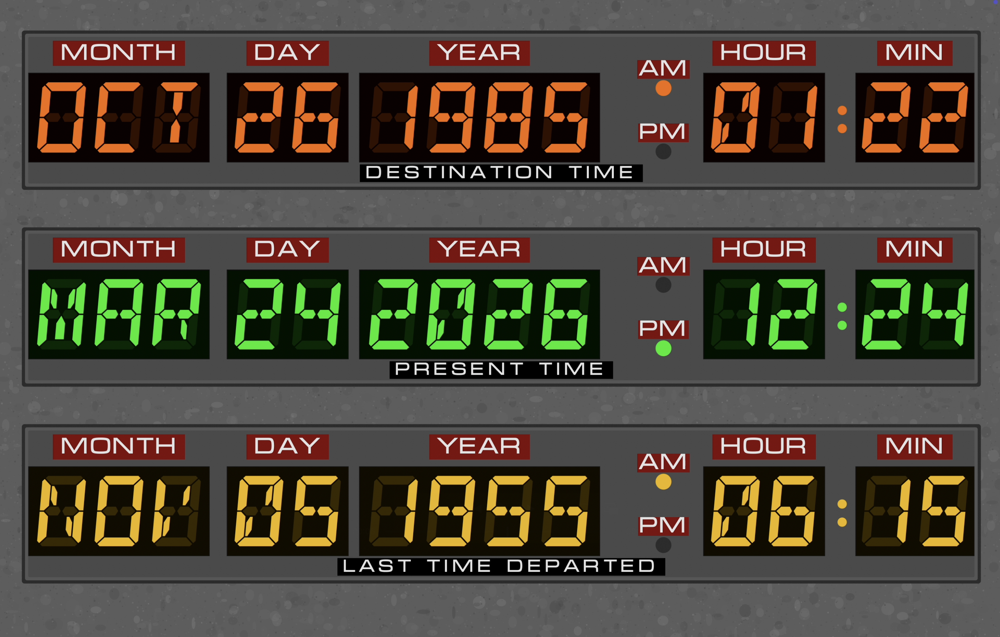
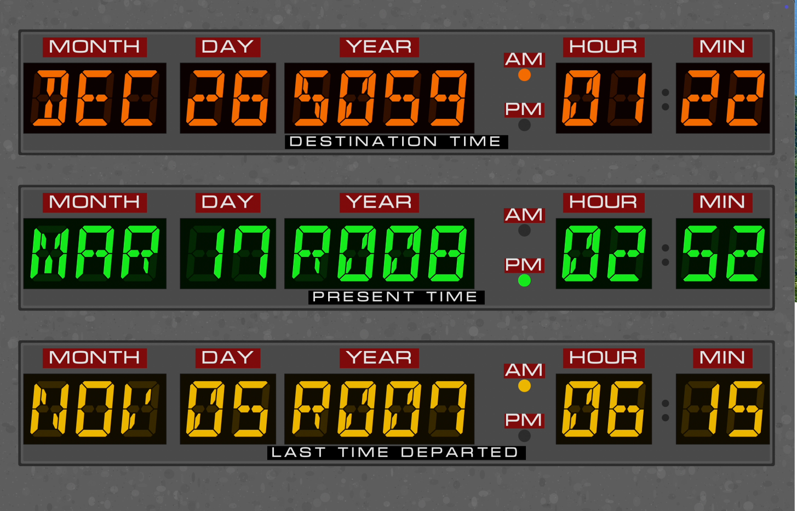

# Dr. Marty McWho's Back to the Future TimeCircuits MacOS Screen Saver 

Enjoy the classic Back to the Future time machine time circuits on your computer!  Take a blast into the past and slap your nerdy nature into gear.  You can select a Destination Time and a Last Time Departed, with code that can also display the Japanese Imperial calendar (***don't worry the Gregorian calendar is default***).  Select any year and time of your choosing and get ready to see some serious shit!  

This alpha release was tested for MacOS 15 (Sequoia) but hasn't been tested with other MacOS versions.  The screen saver will adapt for all screensizes but is intended for wide screens.  Ultra wide screens may see some stretching but it still works.

For Japanese imperial calendar, the letters represent different eras:  
R - Reiwa (2019 - Present)  
H - Heisei (1989 - 2019)  
S - Showa (1926 - 1989)  
T - Taisho (1912 - 1926)  
M - Meiji (1868 - 1912)  

## To install
1. Download the repository (If you don't want to download the full repository, you can just download the release (zip) file.)
2. Unzip the file
3. Double click the TimeCircuits.saver to install
4. Accept any prompts

## How to Configure
1. In System Settings > Screen Saver, select TimeCircuits from the "Other" category
2. Select "Options" next to the preview
3. You can type in any DD/MM/YYYY date and HH:MM time combination you want for "Destination Time" and "Last Time Departed"
4. You can also click the 📅 below each text box and select the date and time from the calendar and clock
5. Select "Allons-y!" to accept the changes
6. Click Preview to verify your settings

## Troubleshooting
I get a black screen.
- This shouldn't happen as this is 90% procedural.  Right click on the screen saver, select delete/uninstall, and then reinstall from the .saver
- If you still get this error after, type "killall legacyScreenSaver" into terminal.  You may have default settings in legacyScreenSaver that is preventing it running.

How do I get my screensaver to show Japanese Imperial calendar?
- You need to set your system settings of your computer to Japanese Imperial, first. System Settings > Language & Region > Calendar select "Japanese"

How do I change the year and month easily in the calendar view?
- This depends on your MacOS, but for all of them, if you enter the year in YYYY in month format and click the 📅, the calendar will update to the year you chose.  Same goes with the month.

### Note: This is an open source project so any reproduction would require author credit and keeping your code open source.  Read the license for details.

Report any additional bugs you might find.
